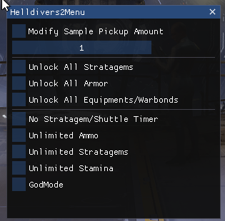

# Helldivers2Menu  

   Helldivers2Menu is a Cheat Menu for the popular Game Helldivers 2.

## Disclaimer
This project is for Educational Use only. We do not condone this software being used to gain an advantage against other people. I made this project for my university project to show how cheating software works and how it is possible to block these manipulations in the future.

## Compile (Configurations)
Please compile the project in **Release** mode. Debug does not work properly and gets detected by GG.

### Version Proxy (version.dll)
Will automatically be loaded by the Game itself if the dll is in the game directory.

### Running on Proton (Version Proxy Only)
First you will need protontricks, you can install it with your packager of choice.

1. Make sure you are running Among Us under Proton  
   You can check by going to **Properties -> Compatibility**
3. Put version.dll into Among Us folder
4. Run `protontricks --gui`
5. Choose **Among Us**
6. Click on **Select the default wineprefix** and then **OK**
7. Click on **Run winecfg** and then **OK**
8. In the configuration window, click on **Libraries**
9. Type `version` into the **New override for library** input
10. Click **Add** and then **Apply**
11. AmongUsMenu should now work properly in the game

### Default Hotkeys
- Show Menu - DELETE

## Screenshot

   

## Contributing
1. Fork it (<https://github.com/BitCrackers/Helldivers2Menu/fork>)
2. Create your feature branch (`git checkout -b feature/fooBar`)
3. Commit your changes (`git commit -am 'Add some fooBar'`)
4. Push to the branch (`git push origin feature/fooBar`)
5. Create a new Pull Request
